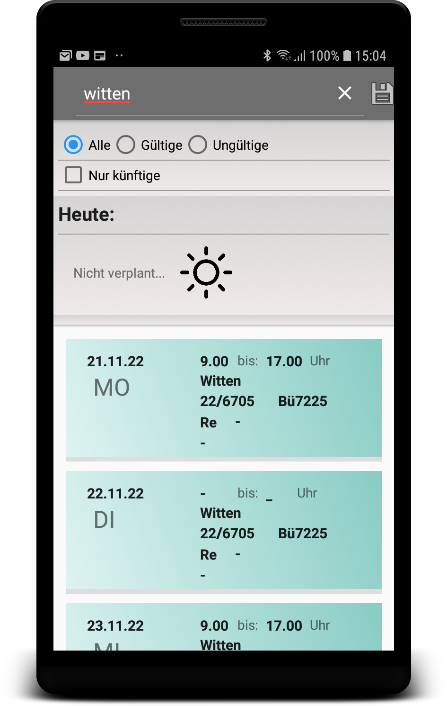
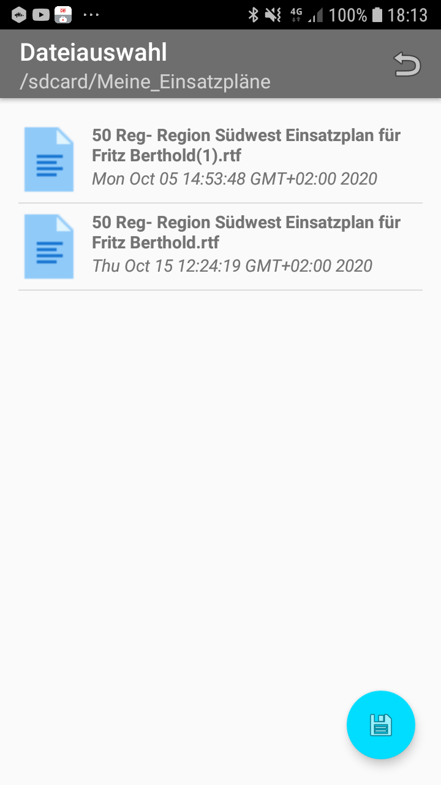
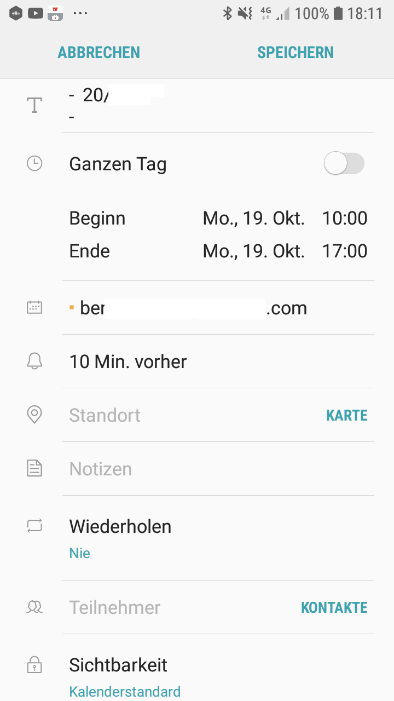

Creates calendar entries for your devices calendar app from a plain text file containing event dates...

Sample job schedule output as provided (old dos x.x software).

Browse through your job schedule. Each entry can be viewed in detail. You can choose to add just the selected entry or the whole course to to devices calendar app. 

Import your latest job schedule.

Add selected events to your devices calendar app.

