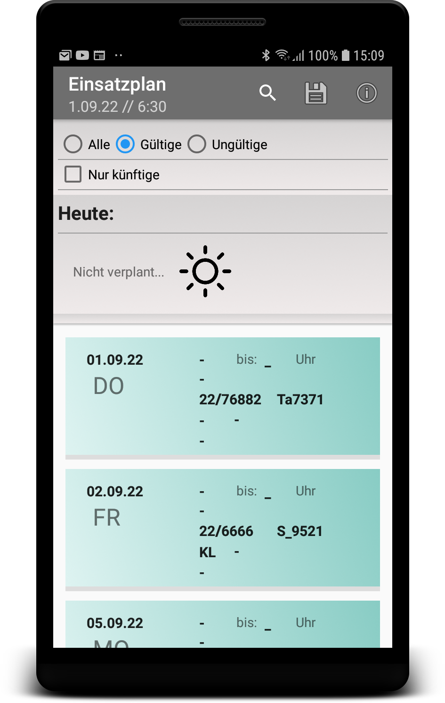

Make Job Schedule
=================

Creates calendar entries for your devices calendar app from a plain text file containing event dates...

<table>
<tr>
  <td>
    
  </td>
  <td>
    
  </td>
</tr>
</table>  

